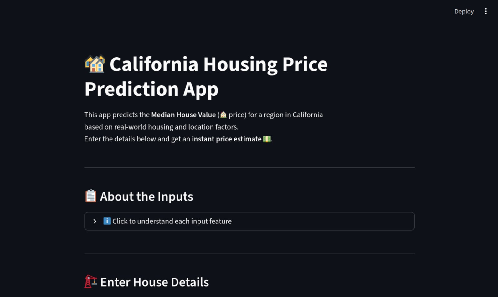

# 🏡 California Housing Price Prediction App

This project predicts the **Median House Value** (🏠 price) for regions in California based on real-world housing and location factors. It uses a **Random Forest Regression Model** trained on the California Housing Dataset.

---

## 🚀 Overview

This web app allows users to input real housing details (like rooms, population, income, etc.) and instantly get an estimated house price. The model is deployed with **Streamlit** for a clean, interactive interface.



---

## 👥 Team Members

* **Bhavini Chauhan** – Deployment Setup, Streamlit Interface, UI Design
* **Anuj Pradhan** – Data Preprocessing, Model Optimization, Model Training

🎓 *3rd Year Design Engineering Students (B.E.)*
🧩 *RNGPIT, Bardoli – Gujarat Technological University*

---

## 🧠 Tech Stack

* **Language:** Python 3.10+
* **Framework:** Streamlit
* **Model:** Random Forest Regressor
* **Libraries:** Pandas, NumPy, Scikit-learn, Joblib, Matplotlib, Seaborn

---

## ⚙️ Installation

### 1️⃣ Clone the repository

```bash
git clone https://github.com/<Bhumi-2303>/housing-price-predictor.git
cd housing-price-predictor
```

### 2️⃣ Create and activate a virtual environment

```bash
python -m venv venv
source venv/bin/activate   # On Windows use: venv\Scripts\activate
```

### 3️⃣ Install dependencies

```bash
pip install -r requirements.txt
```

### 4️⃣ Run the training script (if retraining needed)

```bash
python train_model.py
```

### 5️⃣ Launch the app

```bash
streamlit run app.py
```

---

## 🧩 Features

✅ Real-time prediction of California house prices.
✅ Well-explained user inputs (longitude, latitude, income, population, etc.).
✅ Uses a **trained Random Forest model** stored safely as `.h5`.
✅ Automatic feature scaling and preprocessing.
✅ Beautiful and responsive Streamlit UI.

---

## 📊 Model Training Details

* Dataset: **California Housing Dataset (Sklearn)**
* Model: RandomForestRegressor with GridSearchCV tuning
* Evaluation Metric: R² Score

---

## 📸 Screenshot


---

## 🧾 License

This project is open-source and free to use under the **MIT License**.

---

## 💬 Contact

For any queries or collaboration:

* 📧 Bhavini Chauhan: [[chauhanbhavini87@gmail.com](mailto:chauhanbhvaini87@gmail.com)]
* 📧 Anuj Pradhan: [[anujj.pradhan@gmail.com](mailto:anujjpradhan.com)]

---

### ⭐ Don’t forget to star the repo if you liked it!

---
